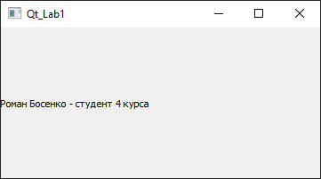
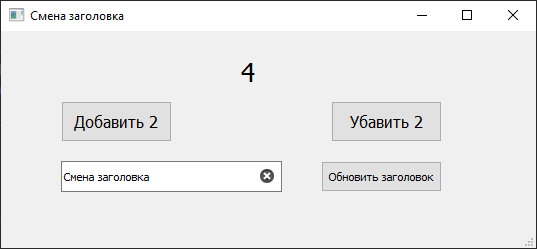
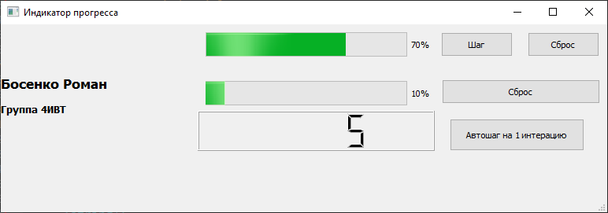
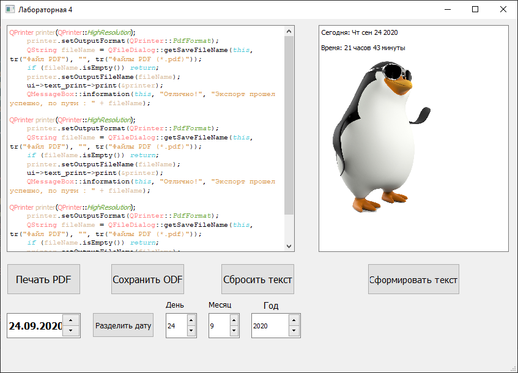
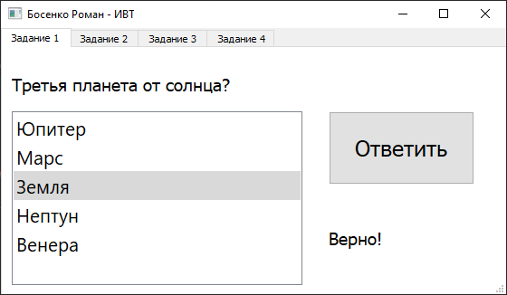
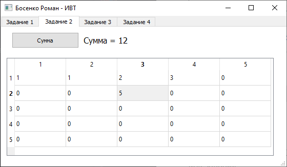
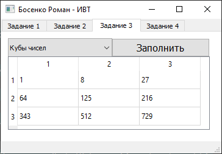
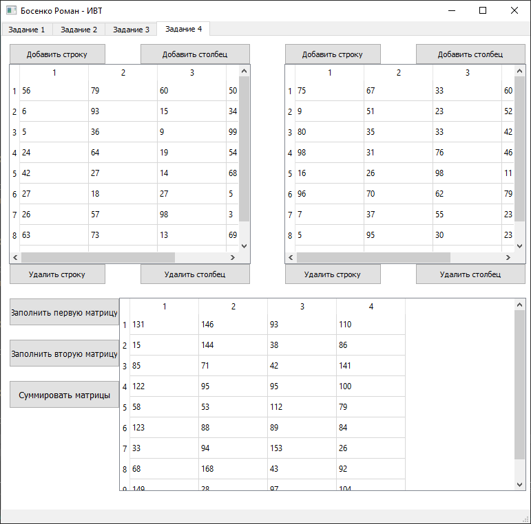

# Лабораторные по предмету ПОАСНИ
[:arrow_forward: Лабораторная 1](#лабораторная-1-white_check_mark)
[:arrow_forward: Лабораторная 2](#лабораторная-2-white_check_mark)
[:arrow_forward: Лабораторная 3](#лабораторная-3-white_check_mark)
[:arrow_forward: Лабораторная 4](#лабораторная-4-white_check_mark)
[:arrow_forward: Лабораторная 5](#лабораторная-5-white_check_mark)
____

Лабораторная 1 :white_check_mark: 
-----------

**Написать приложение, которое выведет ваше «Имя Фамилия – студент 4 курса».**



Файл main.cpp
```c++
#include "mainwindow.h"
#include <QtWidgets/QLabel>
#include <QApplication>

int main(int argc, char *argv[])
{
    QApplication a(argc, argv);
    QLabel lbl("Роман Босенко - студент 4 курса");
    lbl.show();
    return a.exec();
}
```
____
Лабораторная 2 :white_check_mark:
-----------

**Задания для самостоятельной работы:**
- [X] Изменить пример таким образом, чтобы при нажатии на кнопку происходило уменьшение значения на 2. Если достигает -10, то выход из программы.
- [X] Добавить еще одну кнопку, которая увеличивает на 2, если достигло 10, то выход из программы.
- [X] Написать приложение с кнопкой и текстовым полем QLineEdit. При нажатии на кнопку текст, введенный в поле, должен появиться в заголовке программы.



Файл mainwindow.cpp
```c++
#include "mainwindow.h"
#include "ui_mainwindow.h"
int count = 0;
MainWindow::MainWindow(QWidget *parent)
    : QMainWindow(parent)
    , ui(new Ui::MainWindow)
{
    ui->setupUi(this);

}

MainWindow::~MainWindow()
{
    delete ui;
}


void MainWindow::on_pushButtonAdd_clicked()
{
    count += 2;
    ui->label->setText(QString::number(count));
    if(count == 10)
    {
        exit(0);
    }
}

void MainWindow::on_pushButtonLess_clicked()
{
    count -= 2;
    ui->label->setText(QString::number(count));
    if(count == -10)
    {
        exit(0);
    }

}

void MainWindow::on_pushButtonTitle_clicked()
{
    QString title = ui->lineEdit->text();
    this->setWindowTitle(title);
}
```
____
Лабораторная 3 :white_check_mark:
-----------

**Задания для самостоятельной работы:**
- [X] Создать надпись, которая содержит HTML-разметку с заголовком H2 «Имя Фамилия» заголовком H3 «Группа».
- [x] Создать надпись, которая отображает значение индикатора прогресса.
- [X] Создать два индикатора прогресса. Первый от 0 до 10, второй увеличивается после достижения первым значения 10 (максимум также 10).
- :raising_hand: Добавил от себя кнопку автошага, ибо кликать слишком много :see_no_evil:



Файл mainwindow.cpp
```c++
#include "mainwindow.h"
#include "ui_mainwindow.h"


MainWindow::MainWindow(QWidget *parent)
    : QMainWindow(parent)
    , ui(new Ui::MainWindow)
{
    ui->setupUi(this);
    ui->lbName->setText("<h2>Босенко Роман</h2> <h3>Группа 4ИВТ</h3>");

}

MainWindow::~MainWindow()
{
    delete ui;
}


void MainWindow::on_btStep_clicked()
{
    ui->pB_Second->setValue(ui->pB_Second->value() + 1);
    if(ui->pB_Second->value() == 10)
    {
        ui->pb_First->setValue(ui->pb_First->value() + 1);
        ui->pB_Second->setValue(0);
    }
    if(ui->pb_First->value() == 10)
    {
        ui->pb_First->setValue(0);
        ui->lcdInc->display(ui->lcdInc->value() + 1);
    }

}

void MainWindow::on_btResetSecond_clicked()
{
    ui->pB_Second->setValue(0);
}

void MainWindow::on_btResetFirst_clicked()
{
    ui->pb_First->setValue(0);
}


void MainWindow::on_bt_Auto_clicked()
{
    for (int i = 0;i < 100;i++ ) {
        on_btStep_clicked();
    }
}

```

____
Лабораторная 4 :white_check_mark:
-----------

**Задания для самостоятельной работы:**
- [X] Реализовать печать содержимого в PDF и ODF (Добавить две кнопки).
- [x] Создать программу, которая сформирует текст:
    Сегодня <дата> (6 апреля 2017 года)
    Время: 11 часов 53 минуты
    Из этой лабораторной было сделано 2 задания.
    Любая картинка.
- [X] Создать программу, содержащую 3 QSpinBox и 1 QDateTimeEdit. В QDateTimeEdit отобразить текущую дату (только дату), которую требуется разбить на 3 составляющих: д,м,г и их отобразить в QSpinBox.




Код кнопки Печать PDF
```c++
void MainWindow::on_bt_to_PDF_clicked()
{
    QPrinter printer(QPrinter::HighResolution);
    printer.setOutputFormat(QPrinter::PdfFormat);
    QString fileName = QFileDialog::getSaveFileName(this, tr("Файл PDF"), "", tr("Файлы PDF (*.pdf)"));
    if (fileName.isEmpty()) return;
    printer.setOutputFileName(fileName);
    ui->text_print->print(&printer);
    QMessageBox::information(this, "Отлично!", "Экспорт прошел успешно, по пути : " + fileName);
}
```

Код кнопки Сохранить ODF
```c++
void MainWindow::on_bt_to_ODF_clicked()
{
    QString fileName = QFileDialog::getSaveFileName(this, tr("Файл ODF"),"",tr("Файлы ODF (*.odf)"));
    if (fileName.isEmpty()) return;
    QTextDocumentWriter writer(fileName);
    bool success = writer.write(ui->text_print->document());
    if (success)
    {
      QMessageBox::information(this, "Отлично!", "Экспорт прошел успешно, по пути : " + fileName);
    }
    else
    {
      QMessageBox::critical(this, "Ошибка", "При сохранении файла произошла ошибка");
    }
}
```

Код кнопки Сформировать текст
```c++
void MainWindow::on_bt_create_text_clicked()
{
    QDate date = QDate::currentDate();
    QTime time = QTime::currentTime();
    ui->text_create->setHtml("<html>"
                             "<body>"
                             "<p>Сегодня: " + date.toString()+
                             "</p>"
                             "<p>Время: " + time.toString("hh")+
                             " часов " + time.toString("mm") +
                             " минуты</p>"
                             "<p>" + tr("")+
                             "</p>"
                             "</body>"
                             "</html>");
}
```
Код кнопки Разделить дату
```c++
void MainWindow::on_bt_date_clicked()
{
    QDate date = ui->dateTimeEdit->date();
    ui->sBox_day->setValue(date.day());
    ui->sBox_month->setValue(date.month());
    ui->sBox_year->setValue(date.year());

}
```

Файл mainwindow.cpp
```c++
#include "mainwindow.h"
#include "ui_mainwindow.h"
#include <QtPrintSupport/QPrinter>
#include <QMessageBox>
#include <QFileDialog>
#include <QTextDocumentWriter>
#include <QTime>
#include <QDate>
#include <QTextStream>

MainWindow::MainWindow(QWidget *parent)
    : QMainWindow(parent)
    , ui(new Ui::MainWindow)
{
    ui->setupUi(this);

}

MainWindow::~MainWindow()
{
    delete ui;
}


void MainWindow::on_bt_to_PDF_clicked()
{

    QPrinter printer(QPrinter::HighResolution);
    printer.setOutputFormat(QPrinter::PdfFormat);
    QString fileName = QFileDialog::getSaveFileName(this, tr("Файл PDF"), "", tr("Файлы PDF (*.pdf)"));
    if (fileName.isEmpty()) return;
    printer.setOutputFileName(fileName);
    ui->text_print->print(&printer);
    QMessageBox::information(this, "Отлично!", "Экспорт прошел успешно, по пути : " + fileName);

}

void MainWindow::on_bt_to_ODF_clicked()
{
    QString fileName = QFileDialog::getSaveFileName(this, tr("Файл ODF"),"",tr("Файлы ODF (*.odf)"));
    if (fileName.isEmpty()) return;
    QTextDocumentWriter writer(fileName);
    bool success = writer.write(ui->text_print->document());
    if (success)
    {
      QMessageBox::information(this, "Отлично!", "Экспорт прошел успешно, по пути : " + fileName);
    }
    else
    {
      QMessageBox::critical(this, "Ошибка", "При сохранении файла произошла ошибка");
    }
}

void MainWindow::on_bt_reset_clicked()
{
    ui->text_print->setText("");
}

void MainWindow::on_bt_create_text_clicked()
{
    QDate date = QDate::currentDate();
    QTime time = QTime::currentTime();
    ui->text_create->setHtml("<html>"
                             "<body>"
                             "<p>Сегодня: " + date.toString()+
                             "</p>"
                             "<p>Время: " + time.toString("hh")+
                             " часов " + time.toString("mm") +
                             " минуты</p>"
                             "<p>" + tr("")+
                             "</p>"
                             "</body>"
                             "</html>");
}

void MainWindow::on_bt_date_clicked()
{
    QDate date = ui->dateTimeEdit->date();
    ui->sBox_day->setValue(date.day());
    ui->sBox_month->setValue(date.month());
    ui->sBox_year->setValue(date.year());

}


```

____
Лабораторная 5 :white_check_mark:
-----------
**Задания для самостоятельной работы:**
- [X] 1.	Создайте QList, содержащий ответы на какой-нибудь вопрос, помещенный в QLabel. При нажатии на кнопку ответ в дополнительном поле должно отобразиться правильный ли он.
  

  
  Код задания
```c++
void MainWindow::on_bt_answer_clicked()
{
    if(ui->list_answer->currentItem()->text() == "Земля")
    {
        ui->lb_correct->setText("Верно!");
    }
    else
    {
        ui->lb_correct->setText("Не верно!");
    }
}
```
- [X] 2. Написать программу, которая создает таблицу 5*5, заполненную 0. Затем пользователь вписывает туда свои числа. При нажатии на кнопку «Сумма» найти сумму всех чисел в таблице.
   

 
 Код задания
```c++
void MainWindow::on_bt_sum_clicked()
{
    int sum = 0;
    for (int i = 0; i < ui->table_sum->rowCount();i++ )
    {
        for (int j = 0; j < ui->table_sum->columnCount(); j++)
        {
           sum += ui->table_sum->item(i,j)->text().toInt();
        }
    }
    ui->label_sum->setText("Сумма = " + QString::number(sum));

}
```
- [X] 3. Создать программу с ComboBox, который содержит 3 элемента: «квадраты чисел», «кубы чисел» и «числа». При выборе нужного и нажатии на кнопку «создать», заполнить таблицу квадратами, кубами или самими числами от 1 до 9 (таблица 3*3).
  

   
   Код задания
```c++
void MainWindow::on_bt_num_clicked()
{
    if(ui->cb_num->currentIndex() == 0)
    {
        int k = 0;
        for (int i = 0; i < ui->tb_num->rowCount();i++)
        {
            for (int j = 0; j < ui->tb_num->columnCount();j++)
            {
                k++;
                QTableWidgetItem *itm = new QTableWidgetItem(QString::number(k*k));
                ui->tb_num->setItem(i,j,itm);

            }
        }
    }
    if(ui->cb_num->currentIndex() == 1)
    {
        int k = 0;
        for (int i = 0; i < ui->tb_num->rowCount();i++)
        {
            for (int j = 0; j < ui->tb_num->columnCount();j++)
            {
                k++;
                QTableWidgetItem *itm = new QTableWidgetItem(QString::number(k*k*k));
                ui->tb_num->setItem(i,j,itm);

            }
        }
    }
    if(ui->cb_num->currentIndex() == 2)
    {
        int k = 0;
        for (int i = 0; i < ui->tb_num->rowCount();i++)
        {
            for (int j = 0; j < ui->tb_num->columnCount();j++)
            {
                k++;
                QTableWidgetItem *itm = new QTableWidgetItem(QString::number(k));
                ui->tb_num->setItem(i,j,itm);

            }
        }
    }

}
```
- [X] 4. Написать программу суммирования матриц, которые представлены в виде 2-х таблиц. Ответ в третьей.



Код кнопок
```c++
void MainWindow::on_bt_addrow_tb1_clicked()
{
    ui->tb_sum_one->insertRow(ui->tb_sum_one->rowCount());
    on_bt_random_tb1_clicked();
}

void MainWindow::on_bt_addcol_tb1_clicked()
{
    ui->tb_sum_one->insertColumn(ui->tb_sum_one->columnCount());
    on_bt_random_tb1_clicked();
}

void MainWindow::on_bt_delrow_tb1_clicked()
{
    ui->tb_sum_one->setRowCount(ui->tb_sum_one->rowCount() - 1);
}

void MainWindow::on_bt_delcol_tb1_clicked()
{
    ui->tb_sum_one->setColumnCount(ui->tb_sum_one->columnCount() - 1);
}

void MainWindow::on_bt_addrow_tb2_clicked()
{
    ui->tb_sum_two->insertRow(ui->tb_sum_two->rowCount());
    on_bt_random_tb2_clicked();
}

void MainWindow::on_bt_addcol_tb2_clicked()
{
    ui->tb_sum_two->insertColumn(ui->tb_sum_two->columnCount());
    on_bt_random_tb2_clicked();
}

void MainWindow::on_bt_delrow_tb2_clicked()
{
    ui->tb_sum_two->setRowCount(ui->tb_sum_two->rowCount() - 1);
}

void MainWindow::on_bt_delcol_tb1_2_clicked()
{
    ui->tb_sum_two->setColumnCount(ui->tb_sum_two->columnCount() - 1);
}
```

Код рандомного заполнения матриц

```c++
void MainWindow::on_bt_random_tb1_clicked()
{
    for (int i = 0; i < ui->tb_sum_one->rowCount();i++)
    {
        for (int j = 0; j < ui->tb_sum_one->columnCount();j++)
        {

            QTableWidgetItem *itm = new QTableWidgetItem(QString::number(QRandomGenerator::global()->generate()%100+1));
            ui->tb_sum_one->setItem(i,j,itm);

        }
    }
}

void MainWindow::on_bt_random_tb2_clicked()
{
    for (int i = 0; i < ui->tb_sum_two->rowCount();i++)
    {
        for (int j = 0; j < ui->tb_sum_two->columnCount();j++)
        {

            QTableWidgetItem *itm = new QTableWidgetItem(QString::number(QRandomGenerator::global()->generate()%100+1));
            ui->tb_sum_two->setItem(i,j,itm);

        }
    }
}
```
Код суммирования матриц

```c++
void MainWindow::on_bt_sum_matrix_clicked()
{
    if(ui->tb_sum_one->columnCount() != ui->tb_sum_two->columnCount() || ui->tb_sum_one->rowCount() != ui->tb_sum_two->rowCount() )
    {
        QMessageBox::warning(this, "Внимание", "Мартицы должны быть одноразмерными!");
        return;
    }
    ui->tb_all->setColumnCount(ui->tb_sum_one->columnCount());
    ui->tb_all->setRowCount(ui->tb_sum_one->rowCount());

    for (int i = 0; i < ui->tb_all->rowCount();i++)
    {
        for (int j = 0; j < ui->tb_all->columnCount();j++)
        {

            QTableWidgetItem *itm = new QTableWidgetItem(QString::number(ui->tb_sum_one->item(i,j)->text().toInt() + ui->tb_sum_two->item(i,j)->text().toInt()));
            ui->tb_all->setItem(i,j,itm);

        }
    }
}
```
____
Лабораторная 7-1 :white_check_mark:
-----------
